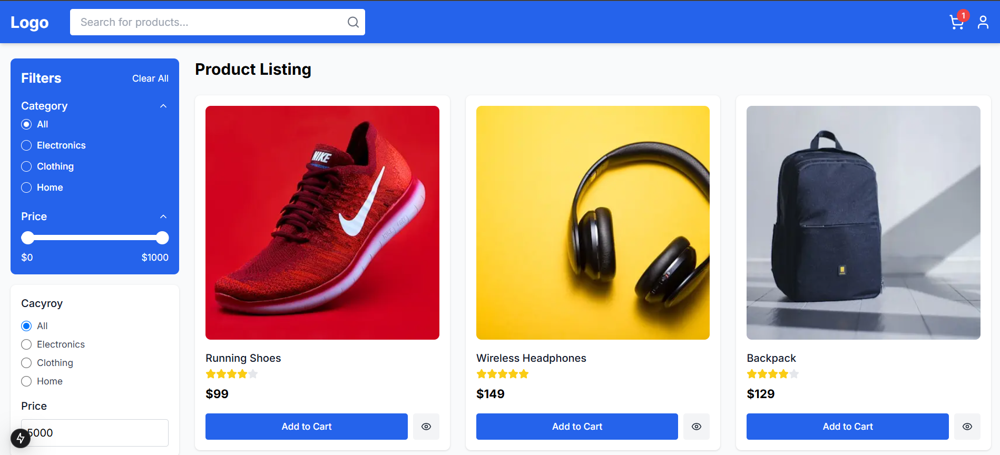
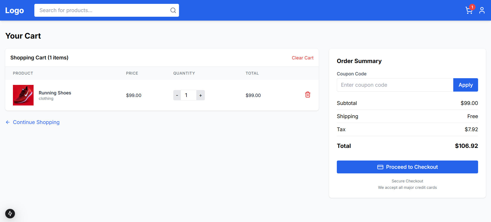

# 🛒 E-commerce

A modern e-commerce platform built with **Next.js**, featuring a responsive design, product filtering, cart functionality, and a complete checkout process.

🔗 **Live Demo**: [https://whatbytes-ecommerce.vercel.app](https://whatbytes-ecommerce.vercel.app)  <!-- Update this URL after deployment -->

---

## ✨ Features

- **Responsive Design**: Fully responsive layout that works on mobile, tablet, and desktop
- **Product Catalog**: Browse products with filtering by category, price range, and brand
- **Product Search**: Search functionality with debounced input
- **Product Details**: Detailed product pages with images, descriptions, and specifications
- **Shopping Cart**: Add, remove, and update quantities of products in cart
- **Checkout Process**: Multi-step checkout with shipping, payment, and order review
- **Order Confirmation**: Confirmation page with order details and status tracking
- **Real-time Cart Updates**: Cart updates in real-time across the application

---

## 📸 Screenshots

### 🏠 Home Page  


### 📄 Product Detail  
.png)
.png)

### 🛒 Shopping Cart  


---

## 🛠 Technologies Used

- **Next.js 14** – React framework with App Router
- **TypeScript** – Type-safe JavaScript
- **Tailwind CSS** – Utility-first CSS framework
- **React Hook Form** – Form validation and handling
- **Lucide React** – Icon library
- **React Context API** – State management for cart
- **Next.js API Routes** – Backend API functionality
- **Vercel** – Deployment platform

---

## 🚀 Getting Started

### ✅ Prerequisites

- Node.js 18.x or later
- npm or yarn

### 📦 Installation

1.Clone the repository:

```bash
git clone https://github.com/yourusername/E-commerce.git
cd E-commerce
```

2.Install dependencies:
```bash
npm install
# or
yarn install
```

3.Run the development server:
```bash
npm run dev
# or
yarn dev
```
4.Open [http://localhost:3000](http://localhost:3000) in your browser to see the application.

## Environment Variables

No environment variables are required for basic functionality. If you add features like authentication or external APIs, you may need to set up environment variables in your Vercel project settings.

## Future Enhancements

- User authentication and account management
- Wishlist functionality
- Product reviews and ratings
- Payment gateway integration (Stripe, PayPal)
- Admin dashboard for product management
- Order history and tracking
- Email notifications

## Acknowledgments

- Product images from [Unsplash](https://unsplash.com)
- Icons from [Lucide React](https://lucide.dev)
- UI components inspired by [shadcn/ui](https://ui.shadcn.com)
```